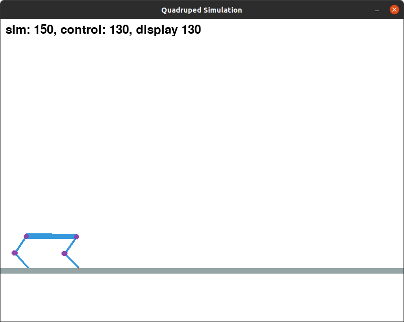

# 2D Quadruped Simulator #

 a simple quadruped simulator for learning legged locomotion

 Uses pymunk as physics simulator, pygame as graphics and joystick handler, and gurobi as optimization solver
